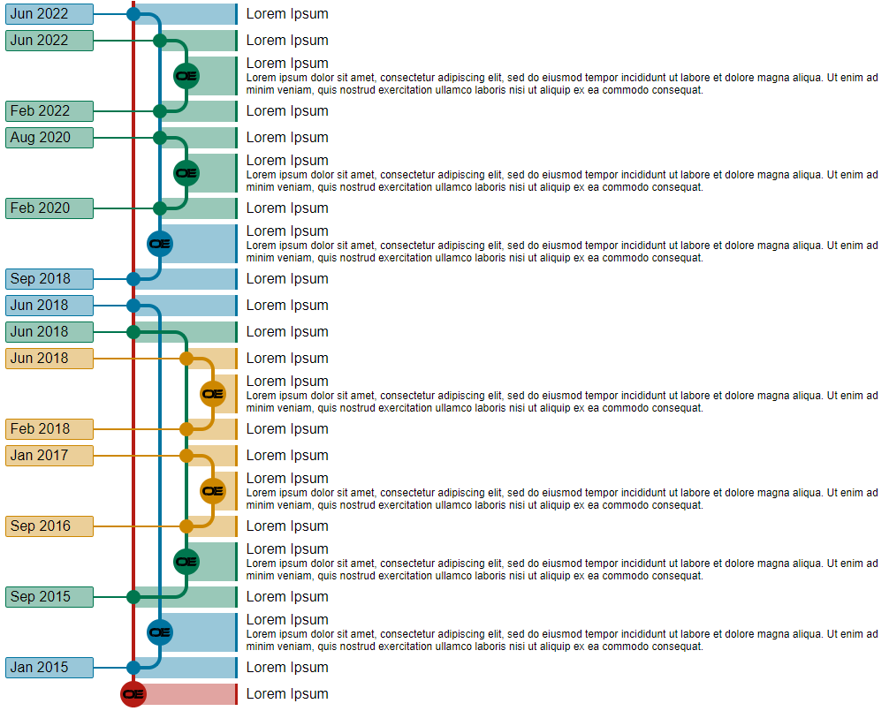
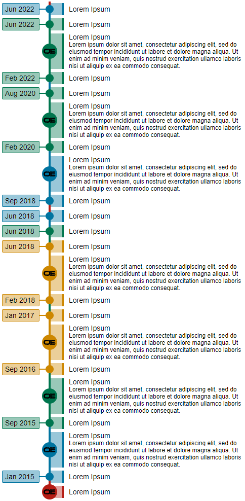

# GitFlow Component

## Introduction

This is a Vue component, that imitates the looks of the flow in git like the known Git applications GitKraken or Fork.

I used it to show my timeline in a unique programmer way, but could be used for your own ideas, like displaying your
gitflow from your project. Though, this component is just focussed on the visuals of the git flow, so you need to create
the array of rows yourself.

## Preview

### Desktop Preview



### Mobile Preview



## Installation
The component makes use of Vue 2.6.14 and can be easily installed with [NPM](https://www.npmjs.com/package/gitflow-component):
```shell
npm install gitflow-component
```

## Usage
[Try it out in the Code SandBox!](https://codesandbox.io/s/gitflow-example-86xfdc)

After installing the npm package, you can go ahead and add it to your
`main.js` file in your `./src/` folder. The file looks like the following:
```js
import Vue from "vue";
import App from "./App.vue";
import GitFlow from "gitflow-component";

Vue.use(GitFlow);

new Vue({
  render: function (h) {
    return h(App);
  }
}).$mount("#app");

```

Afterwards, the component can be used. The component can be used like the following:
```vue
<template>
  <GitFlow :items="items" :colors="colors" />
</template>

<script>
import GitFlow from "gitflow-component";
export default {
    name: "App",
    components: {
        GitFlow
    }
};
```

The Component does ask for 2 properties like `items` and `colors`.
`items` is an array of items that is displayed.
`colors` is an array of colors, e.g. a hex color code in a string.

### Colors
The first color is a placeholder, since the array in the component starts with index 1.
The amount of colors depend on the amount of unique branche columns. E.g. 5 colors means
a maximum of 4 columns.

The example used for the preview is as following:
```js
colors: ["#000000", "#b51c14", "#0074A0", "#00764E", "#cd8700"]
```

### Items
An item can have multiple properties like:
- `line`: The number on which column it is placed (from left to right)
- `tag`: The text of the tag. 
- `style`: the type of row, you can choose out of `start`, `merge` or `commit`.
- `start`: in case the style is start, you specify the line of the start point.
- `merge`: in case the style is merge, you specify the line of the merge point.
- `msg`: The message of the row.
- `desc`: The small description below the message.
- `img`: The location path to the image. No image means, it will stay a small bullet.
- `spacing`: The amount of spacing for the desktop version.

The example used for the preview is as following:
```js
items: [
      {
        line: 2,
        tag: "Jun 2022",
        style: "merge",
        merge: 1,
        spacing: 2,
        msg: "Lorem Ipsum",
      },
      {
        line: 3,
        tag: "Jun 2022",
        style: "merge",
        merge: 2,
        spacing: 1,
        msg: "Lorem Ipsum",
      },
      {
        line: 3,
        style: "commit",
        spacing: 1,
        msg: "Lorem Ipsum",
        desc:
          "Lorem ipsum dolor sit amet, consectetur adipiscing elit, sed do eiusmod tempor incididunt ut labore et dolore magna aliqua. Ut enim ad minim veniam, quis nostrud exercitation ullamco laboris nisi ut aliquip ex ea commodo consequat.",
        img: "https://www.omererdem.nl/img/company/logo.webp",
      },
      {
        line: 3,
        tag: "Feb 2022",
        style: "start",
        start: 2,
        spacing: 1,
        msg: "Lorem Ipsum",
      },
      {
        line: 3,
        tag: "Aug 2020",
        style: "merge",
        merge: 2,
        spacing: 1,
        msg: "Lorem Ipsum",
      },
      {
        line: 3,
        style: "commit",
        spacing: 1,
        msg: "Lorem Ipsum",
        desc:
          "Lorem ipsum dolor sit amet, consectetur adipiscing elit, sed do eiusmod tempor incididunt ut labore et dolore magna aliqua. Ut enim ad minim veniam, quis nostrud exercitation ullamco laboris nisi ut aliquip ex ea commodo consequat.",
        img: "https://www.omererdem.nl/img/company/logo.webp",
      },
      {
        line: 3,
        tag: "Feb 2020",
        style: "start",
        start: 2,
        spacing: 1,
        msg: "Lorem Ipsum",
      },
      {
        line: 2,
        style: "commit",
        spacing: 2,
        msg: "Lorem Ipsum",
        desc:
          "Lorem ipsum dolor sit amet, consectetur adipiscing elit, sed do eiusmod tempor incididunt ut labore et dolore magna aliqua. Ut enim ad minim veniam, quis nostrud exercitation ullamco laboris nisi ut aliquip ex ea commodo consequat.",
        img: "https://www.omererdem.nl/img/company/logo.webp",
      },
      {
        line: 2,
        tag: "Sep 2018",
        style: "start",
        start: 1,
        spacing: 2,
        msg: "Lorem Ipsum",
      },
      {
        line: 2,
        tag: "Jun 2018",
        style: "merge",
        merge: 1,
        spacing: 2,
        msg: "Lorem Ipsum",
      },
      {
        line: 3,
        tag: "Jun 2018",
        style: "merge",
        merge: 1,
        spacing: 1,
        msg: "Lorem Ipsum",
      },
      {
        line: 4,
        tag: "Jun 2018",
        style: "merge",
        merge: 3,
        spacing: 0,
        msg: "Lorem Ipsum",
      },
      {
        line: 4,
        style: "commit",
        spacing: 0,
        msg: "Lorem Ipsum",
        desc:
          "Lorem ipsum dolor sit amet, consectetur adipiscing elit, sed do eiusmod tempor incididunt ut labore et dolore magna aliqua. Ut enim ad minim veniam, quis nostrud exercitation ullamco laboris nisi ut aliquip ex ea commodo consequat.",
        img: "https://www.omererdem.nl/img/company/logo.webp",
      },
      {
        line: 4,
        tag: "Feb 2018",
        style: "start",
        start: 3,
        spacing: 0,
        msg: "Lorem Ipsum",
      },
      {
        line: 4,
        tag: "Jan 2017",
        style: "merge",
        merge: 3,
        spacing: 0,
        msg: "Lorem Ipsum",
      },
      {
        line: 4,
        style: "commit",
        spacing: 0,
        msg: "Lorem Ipsum",
        desc:
          "Lorem ipsum dolor sit amet, consectetur adipiscing elit, sed do eiusmod tempor incididunt ut labore et dolore magna aliqua. Ut enim ad minim veniam, quis nostrud exercitation ullamco laboris nisi ut aliquip ex ea commodo consequat.",
        img: "https://www.omererdem.nl/img/company/logo.webp",
      },
      {
        line: 4,
        tag: "Sep 2016",
        style: "start",
        start: 3,
        spacing: 0,
        msg: "Lorem Ipsum",
      },
      {
        line: 3,
        style: "commit",
        spacing: 1,
        msg: "Lorem Ipsum",
        desc:
          "Lorem ipsum dolor sit amet, consectetur adipiscing elit, sed do eiusmod tempor incididunt ut labore et dolore magna aliqua. Ut enim ad minim veniam, quis nostrud exercitation ullamco laboris nisi ut aliquip ex ea commodo consequat.",
        img: "https://www.omererdem.nl/img/company/logo.webp",
      },
      {
        line: 3,
        tag: "Sep 2015",
        style: "start",
        start: 1,
        spacing: 1,
        msg: "Lorem Ipsum",
      },
      {
        line: 2,
        style: "commit",
        spacing: 2,
        msg: "Lorem Ipsum",
        desc:
          "Lorem ipsum dolor sit amet, consectetur adipiscing elit, sed do eiusmod tempor incididunt ut labore et dolore magna aliqua. Ut enim ad minim veniam, quis nostrud exercitation ullamco laboris nisi ut aliquip ex ea commodo consequat.",
        img: "https://www.omererdem.nl/img/company/logo.webp",
      },
      {
        line: 2,
        tag: "Jan 2015",
        style: "start",
        start: 1,
        spacing: 2,
        msg: "Lorem Ipsum",
      },
      {
        line: 1,
        style: "commit",
        spacing: 3,
        msg: "Lorem Ipsum",
        img: "https://www.omererdem.nl/img/company/logo.webp",
      },
    ]
```


## Questions
For questions hit me up. 
Also for new features or donations. 
And yes... I did rush the documentation. Feel free to contribute to it.
